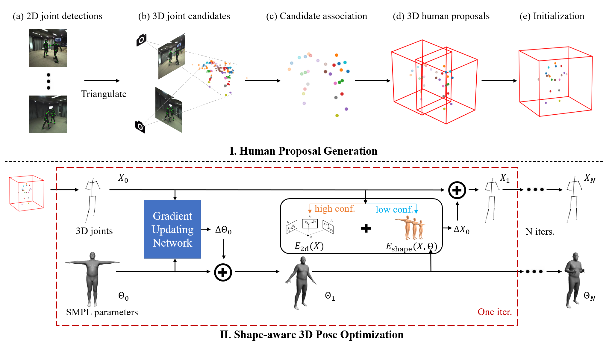

# Shape-aware Multi-Person Pose Estimation from Multi-view Images (ICCV 2021)
### [Project Page](https://ait.ethz.ch/projects/2021/multi-human-pose/) | [Video](https://www.youtube.com/watch?v=KE5Jpnyqmh4&t=99s) | [Paper](https://arxiv.org/abs/2110.02330) | [Supplementary](https://ait.ethz.ch/projects/2021/multi-human-pose/supplementary.pdf) | [Blog](https://eth-ait.medium.com/shape-aware-multi-person-pose-estimation-from-multi-view-images-1c513d3a8dc)



> [Shape-aware Multi-Person Pose Estimation from Multi-view Images](https://arxiv.org/abs/2110.02330)  
> Zijian Dong, Jie Song, Xu Chen, Chen Guo, Otmar Hilliges  
> ICCV 2021

Any questions or discussions are welcomed!

The code will be available soon.

# Cite

```
@inproceedings{dong2021shape,
  title={Shape-aware Multi-Person Pose Estimation from Multi-view Images},
  author={Dong, Zijian and Song, Jie and Chen, Xu and Guo, Chen and  Hilliges, Otmar},
  booktitle={International Conference on Computer Vision (ICCV)},
  year={2021}
}
```


